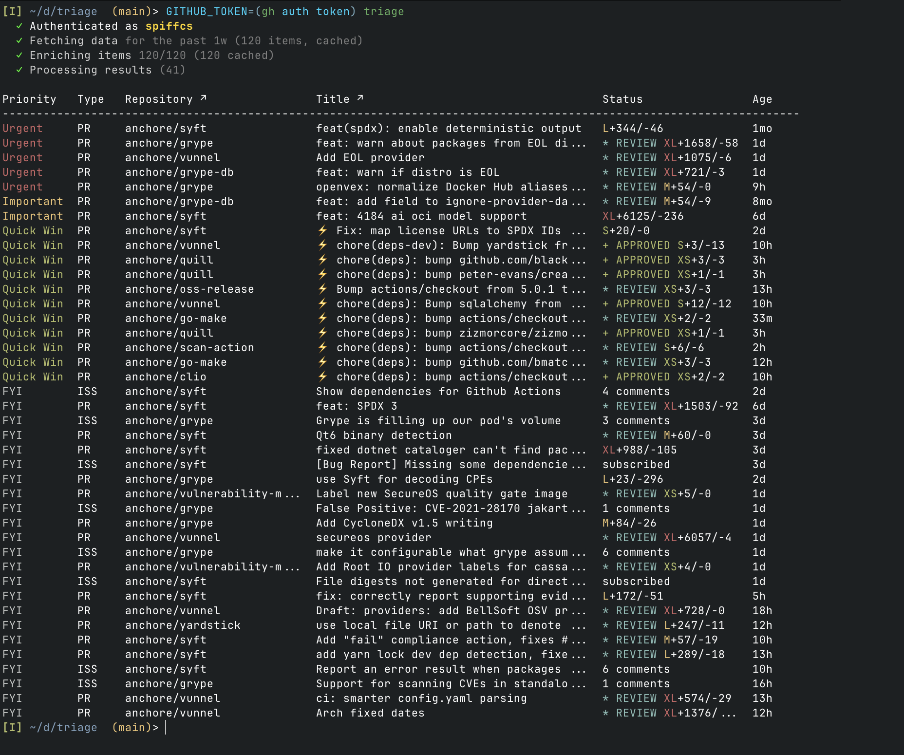

# triage

A terminal UI that helps you prioritize GitHub work. It pulls together unread notifications, PRs awaiting your review, PRs you've authored, issues assigned to you, and orphaned worke. It then scores and ranks them so you can focus on what matters most.



## Quick Start

```bash
GITHUB_TOKEN=$(gh auth token) triage
```

## Interactive TUI

The default interface is an interactive terminal UI with keyboard navigation:

| Key | Action |
|-----|--------|
| `j` / `↓` | Move cursor down |
| `k` / `↑` | Move cursor up |
| `g` / `Home` | Jump to top |
| `G` / `End` | Jump to bottom |
| `Enter` | Open item in browser |
| `d` | Mark item as done (removes from list) |
| `q` / `Esc` | Quit |

The TUI displays color-coded priorities, PR review status, and size indicators (XS/S/M/L/XL based on lines changed). Items marked as done are persisted and will not reappear unless they have new activity.

## Installation

```bash
curl -sSfL https://tools.aithirne.com/triage | sudo sh -s -- -b /usr/local/bin
```

Or install with Go:

```bash
go install github.com/spiffcs/triage@latest
```

Or build from source:

```bash
git clone https://github.com/spiffcs/triage.git
cd triage
go build -o triage ./cmd/triage
```

## Usage

### List Items

```bash
# Ensure GITHUB_TOKEN is set (see Quick Start above)
# List prioritized notifications (default: last 1 week)
triage

# Limit time range (default: 1w)
triage --since 30m     # Last 30 minutes
triage --since 2h      # Last 2 hours
triage --since 1d      # Last day
triage --since 1w      # Last week
triage --since 30d     # Last 30 days
triage --since 6mo     # Last 6 months
triage --since 1y      # Last year

# Supported time units:
#   Minutes: m, min, mins
#   Hours:   h, hr, hrs, hour, hours
#   Days:    d, day, days
#   Weeks:   w, wk, wks, week, weeks
#   Months:  mo, month, months (30 days)
#   Years:   y, yr, yrs, year, years (365 days)

# Filter by priority
triage -p urgent
triage -p important
triage -p quick-win
triage -p notable
triage -p fyi

# Filter by notification reason
triage -r mention
triage -r review_requested
triage -r author

# Filter by type
triage -t pr          # Show only pull requests
triage -t issue       # Show only issues

# Filter by repository
triage --repo owner/repo

# Include merged/closed items (hidden by default)
triage --include-merged
triage --include-closed

# Show only PRs with passing CI (excludes issues)
triage --green-ci

# Output formats
triage               # Interactive TUI (default)
triage -f json       # JSON for scripting

# Limit results
triage -l 20         # Show only first 20 items
```

### Orphaned Contributions

Find external contributions (PRs and issues from non-team members) that haven't received team engagement. This helps teams identify community contributions that may be falling through the cracks.

```bash
# Search specific repositories
triage orphaned --repos anchore/vunnel,anchore/grype

# Use config file settings (see Configuration section)
triage orphaned

# Customize detection thresholds
triage orphaned --repos myorg/myrepo --stale-days 14 --consecutive 3

# Look back further in time
triage orphaned --repos myorg/myrepo --since 60d

# Output as JSON for scripting
triage orphaned --repos myorg/myrepo -f json

# Verbose mode (disables TUI, shows logs)
triage orphaned --repos myorg/myrepo -v
```

**Flags:**

| Flag | Default | Description |
|------|---------|-------------|
| `--repos` | (from config) | Repositories to monitor (owner/repo) |
| `--since` | `30d` | Look back period for contributions |
| `--stale-days` | `7` | Days without team activity to be considered orphaned |
| `--consecutive` | `2` | Consecutive author comments without response to flag |
| `--limit` | `50` | Maximum results to display |
| `-f, --format` | `table` | Output format (table, json) |
| `-v, --verbose` | `0` | Increase verbosity (-v info, -vv debug) |
| `--tui` | `auto` | Enable/disable TUI (true, false, auto) |

**Detection criteria:**

An item is flagged as orphaned when:
- No team member has responded in the configured number of days (`--stale-days`), OR
- The author has posted multiple consecutive comments without a team response (`--consecutive`)

External contributors are identified by their author association (not MEMBER, OWNER, or COLLABORATOR).

**Interactive TUI:**

The orphaned command uses the same interactive TUI as the main `triage` command, with a customized layout:
- **Signal column** shows why each item needs attention (e.g., "3 unanswered", "No response 14d")
- Keyboard navigation, mark as done, and open in browser work the same way

### Cache Management

The tool uses a three-tier caching strategy to reduce API usage:
- **Item details** (issue/PR metadata): cached for 24 hours
- **Notification lists**: cached for 1 hour
- **PR lists** (review-requested and authored PRs): cached for 5 minutes

```bash
triage cache stats    # Show cache statistics
triage cache clear    # Clear all caches
```

### Rate Limit Management

Check your GitHub API rate limit status:

```bash
triage ratelimit status
```

Example output:
```
GitHub API Rate Limits:

Core API:   4521/5000 remaining (resets in 42m15s)
Search API: 28/30 remaining (resets in 45s)
GraphQL:    4892/5000 remaining (resets in 42m15s)
```

### Configuration

Manage configuration files and view current settings.

```bash
triage config             # Show current merged configuration
triage config init        # Create a minimal config file (prompts for location)
triage config init --global  # Create global config (~/.config/triage/config.yaml)
triage config init --local   # Create local config (./.triage.yaml)
triage config path        # Show config file locations and which exist
triage config defaults    # Show all default values (useful for creating full config)
triage config show        # Show current merged config (same as bare 'triage config')
```

Configuration is loaded in order: **defaults → global → local** (local values override global).

## Priority Scoring

Notifications are scored based on multiple factors to determine priority.

### Base Scores by Notification Reason

| Reason | Score | Description |
|--------|-------|-------------|
| `review_requested` | 100 | Someone requested your review |
| `mention` | 90 | You were directly @mentioned |
| `team_mention` | 85 | Your team was @mentioned |
| `author` | 70 | Activity on an issue/PR you created |
| `assign` | 60 | You were assigned to the issue |
| `comment` | 30 | New comment on a thread you're watching |
| `state_change` | 25 | Issue/PR was opened, closed, or merged |
| `subscribed` | 10 | Activity on a repo you're watching |
| `ci_activity` | 5 | CI/CD activity |

### Score Modifiers

| Modifier | Score | Condition |
|----------|-------|-----------|
| Open state | +10 | Issue/PR is still open |
| Closed state | -30 | Issue/PR was closed/merged |
| Hot topic | +15 | More than 6 comments (threshold configurable) |
| Low-hanging fruit | +20 | Small PR or has quick-win label |
| Age bonus | +2/day | Older unread items (capped at +30) |

### Score-Based Priority Promotion

Items can be promoted to higher priority levels based on their total score:

| Promotion | Threshold | Description |
|-----------|-----------|-------------|
| FYI → Notable | ≥35 | Items with moderate engagement |
| Notable → Important | ≥60 | Items with significant activity |
| Important → Urgent | ≥100 | High-signal items requiring immediate attention |

### PR Scoring (Your Authored PRs)

When you're the author of a PR, additional modifiers apply to help surface PRs that need your attention:

| Modifier | Score | Condition |
|----------|-------|-----------|
| Approved | +25 | PR has been approved |
| Mergeable | +15 | PR can be merged (no conflicts) |
| Changes requested | +20 | Reviewer requested changes |
| Review comments | +3/comment | Per review comment (capped at +15) |
| Stale PR | +2/day | PR idle >7 days (capped at +20) |
| Draft | -25 | PR is still in draft state |

These modifiers help prioritize:
- **Approved + Mergeable PRs**: Ready to merge, take action now
- **Changes Requested**: Address feedback to unblock the PR
- **Stale PRs**: PRs that have gone quiet and may need a nudge
- **Draft PRs**: Lower priority since they're not ready for review

### PR Size Thresholds

PRs are labeled with T-shirt sizes based on lines changed (additions + deletions):

| Size | Lines Changed |
|------|---------------|
| XS | ≤10 |
| S | ≤50 |
| M | ≤200 |
| L | ≤500 |
| XL | >500 |

Small PRs (≤5 files AND ≤100 lines) are automatically marked as "Quick Win".

### Priority Levels

Priority is determined by a combination of notification reason, item state, and score. The priority level affects how items are displayed and sorted in the TUI.

| Priority | Color | Description |
|----------|-------|-------------|
| **Urgent** | Red | Requires immediate attention |
| **Important** | Yellow | Should address soon |
| **Quick Win** | Green | Easy wins, good for quick progress |
| **Notable** | Blue | Worth attention, promoted by score |
| **FYI** | Gray | Informational, review when time permits |

### How Priority is Determined

Priority assignment follows this logic (evaluated in order):

1. **Urgent** is assigned when:
   - Notification reason is `review_requested` (configurable via `urgency.review_requested`)
   - Your authored PR is approved AND mergeable (configurable via `urgency.approved_mergeable_pr`)
   - Other urgency triggers if enabled: `mention`, `changes_requested_pr`
   - Item's score ≥100 (important_promotion_threshold)

2. **Quick Win** is assigned when:
   - Item has a quick-win label (e.g., `good first issue`, `help wanted`)
   - PR is small (≤5 files AND ≤100 lines changed)

3. **Important** is assigned when:
   - Notification reason is `author`, `assign`, or `team_mention`
   - Item's score ≥60 (notable_promotion_threshold)

4. **Notable** is assigned when:
   - Item's score ≥35 (fyi_promotion_threshold)

5. **FYI** is assigned for everything else (subscribed, comments, CI activity, etc.)

### Score-Based Promotion

Items are promoted through the priority hierarchy based on their total score. This allows high-activity or aging items to bubble up in priority:

```
Score:  0    10   20   30   35   50   60   80   100  120
        |----FYI----|---Notable---|---Important---|--Urgent-->
        ^subscribed ^comment      ^               ^
                    fyi_threshold notable_thresh  important_thresh
```

For example, a `subscribed` notification (base score: 10) could be promoted:
- To **Notable** if it's a hot topic (+15) on an open issue (+10) — total 35
- To **Important** if it's also been unread for 15 days (+30) — total 65
- To **Urgent** if it accumulates even more signals to reach 100+

This ensures that even low-priority notifications get attention if they accumulate enough signals.

## Configuration File

Config files are loaded in order, with later values overriding earlier ones:

1. **Defaults** - Built-in sensible defaults
2. **Global** - `~/.config/triage/config.yaml` (XDG config directory)
3. **Local** - `./.triage.yaml` (current directory, useful for per-project settings)

You only need to specify values you want to override:

```yaml
# Minimal config - only specify what you want to change
default_format: table

# Exclude noisy repos (optional)
# exclude_repos:
#   - kubernetes/kubernetes
#   - some-org/noisy-repo

# Exclude bot authors (optional)
# exclude_authors:
#   - dependabot[bot]
#   - renovate[bot]
```

### Customizing Score Weights

You can override the default scoring weights in your config file. Any values not specified will use the defaults shown above.

```yaml
base_scores:
  review_requested: 120    # Boost review requests
  mention: 95
  team_mention: 85
  author: 70
  assign: 60
  comment: 30
  state_change: 25
  subscribed: 10
  ci_activity: 5

scoring:
  old_unread_bonus: 2      # Per day
  max_age_bonus: 30
  hot_topic_bonus: 15
  hot_topic_threshold: 6
  fyi_promotion_threshold: 35       # FYI → Notable
  notable_promotion_threshold: 60   # Notable → Important
  important_promotion_threshold: 100 # Important → Urgent
  open_state_bonus: 10
  closed_state_penalty: -50  # Penalize closed items more
  low_hanging_bonus: 20

pr:
  approved_bonus: 25
  mergeable_bonus: 15
  changes_requested_bonus: 20
  review_comment_bonus: 3
  review_comment_max_bonus: 15
  stale_threshold_days: 7
  stale_bonus_per_day: 2
  stale_max_bonus: 20
  draft_penalty: -25
  small_max_files: 5       # Files threshold for "small PR" detection
  small_max_lines: 100     # Lines threshold for "small PR" detection
  size_xs: 10              # PR size thresholds (lines changed)
  size_s: 50
  size_m: 200
  size_l: 500
```

Only specify the weights you want to change:

```yaml
base_scores:
  review_requested: 200    # Really prioritize reviews

scoring:
  closed_state_penalty: -100  # Heavily penalize closed items
  important_promotion_threshold: 90  # Lower bar for Urgent promotion
```

### Customizing Quick Win Labels

By default, items with these label patterns are marked as "Quick Win":
- `good-first-issue`, `help-wanted`
- `easy`, `beginner`, `trivial`
- `documentation`, `docs`, `typo`

You can override these with your own labels:

```yaml
quick_win_labels:
  - good-first-issue
  - help-wanted
  - low-hanging-fruit
  - quick-fix
  - starter
```

Labels are matched case-insensitively, use substring matching (e.g., `doc` matches `documentation`), and treat hyphens and spaces as equivalent (e.g., `good first issue` matches `good-first-issue`).

### Excluding Bot Authors

You can filter out PRs and issues from automated accounts like Dependabot or Renovate:

```yaml
exclude_authors:
  - dependabot[bot]
  - renovate[bot]
  - github-actions[bot]
```

This removes items authored by these accounts from your triage list, reducing noise from automated dependency updates.

### Configuring Orphaned Detection

Configure defaults for the `triage orphaned` command to monitor your team's repositories:

```yaml
orphaned:
  repos:
    - myorg/repo1
    - myorg/repo2
  stale_days: 7                      # Days without team response
  consecutive_author_comments: 2     # Consecutive unanswered comments
  max_items_per_repo: 50             # Limit per repository
```

With this configuration, running `triage orphaned` will automatically use these settings without requiring command-line flags.

### Customizing Urgency Triggers

By default, review requests and approved mergeable PRs automatically mark items as **Urgent** priority. You can customize these triggers to match your workflow:

```yaml
urgency:
  review_requested: true       # Review requests → Urgent (default: true)
  mention: false               # Direct @mentions → Urgent (default: false)
  approved_mergeable_pr: true  # Your approved+mergeable PRs → Urgent (default: true)
  changes_requested_pr: false  # Your PRs with changes requested → Urgent (default: false)
```

For example, if you want mentions to also be urgent:

```yaml
urgency:
  mention: true
```

Or if you want to disable all automatic urgency triggers and rely purely on score-based promotion:

```yaml
urgency:
  review_requested: false
  approved_mergeable_pr: false
```

When a trigger is disabled, items that would have been marked Urgent will instead be assigned priority based on their score (see [Score-Based Promotion](#score-based-promotion)).

## Cache Location

Cached data is stored at `~/.cache/triage/details/`.

## License

Apache-2.0
